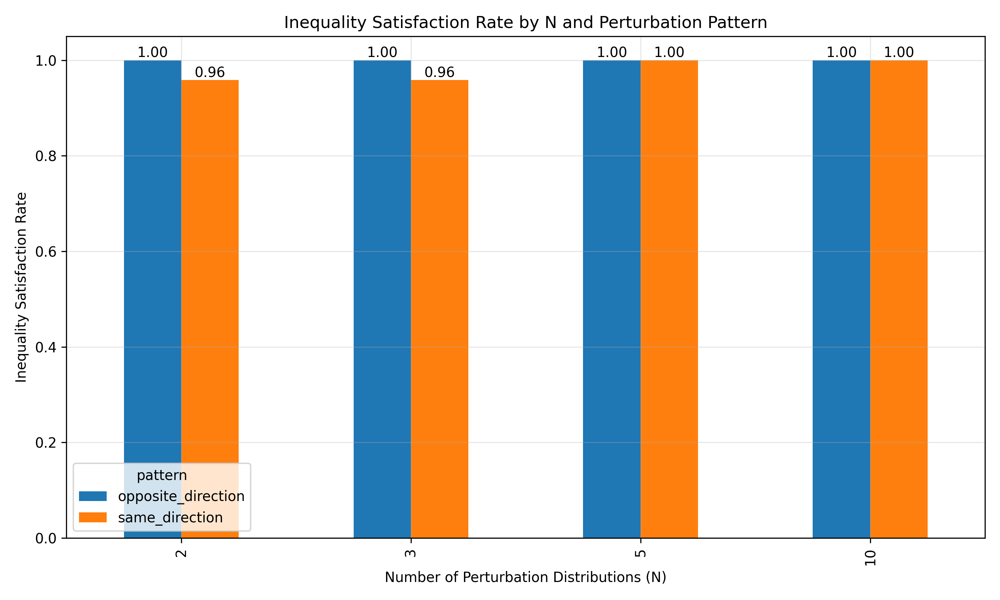

# 双参数扰动

本文档展示了同时考虑位置和尺度参数扰动的实验结果可视化。

## 1. 同向扰动

下面的热图展示了不同位置参数和尺度参数组合下不等式成立的情况，其中颜色表示不等式成立的比例（1.00表示完全成立）。

### N=2 的情况

### N=3 的情况

### N=5 的情况

### N=10 的情况

从热图可以看出，在所有测试的参数组合下，不等式都成立（值为1.00）。

## 2. 反向扰动

下面的热图展示了反向扰动情况下不同参数组合的不等式成立情况。

### N=2 的情况

### N=3 的情况

### N=5 的情况

### N=10 的情况

同样，在所有测试的参数组合下，不等式都成立。

## 3. 不等式成立比例

下图展示了不同N值和扰动模式下不等式成立的比例：

从图中可以看出，在所有测试的N值和扰动模式下，不等式都成立（比例为1.00）。

## 4. KL散度比率分析

下图展示了不同N值和扰动模式下KL散度比率的分布：

从图中可以观察到：
- 所有比率都小于1，表明不等式在所有测试情况下都成立
- 反向扰动下的比率通常小于同向扰动
- 随着N的增加，比率整体呈下降趋势

这些结果表明，在同时考虑位置和尺度参数扰动的情况下，KL散度不等式 $D_{KL}(P_0 \| P_{fused}) \le N \sum_{k=1}^N D_{KL}(P_0 \| P_k)$ 在所有测试的参数配置下都成立。
