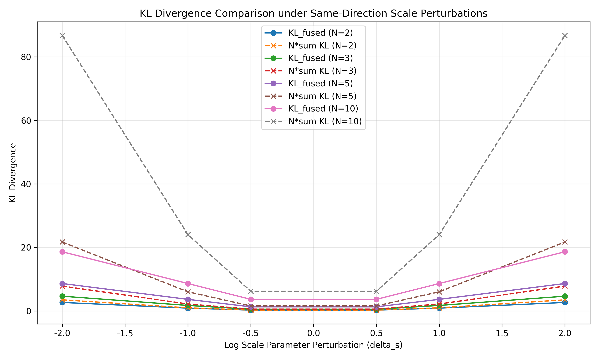
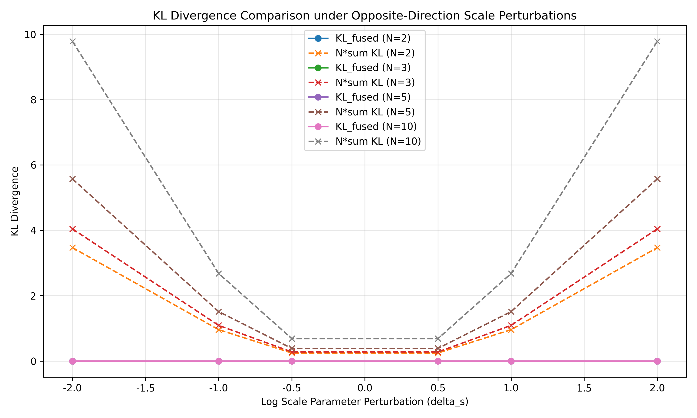
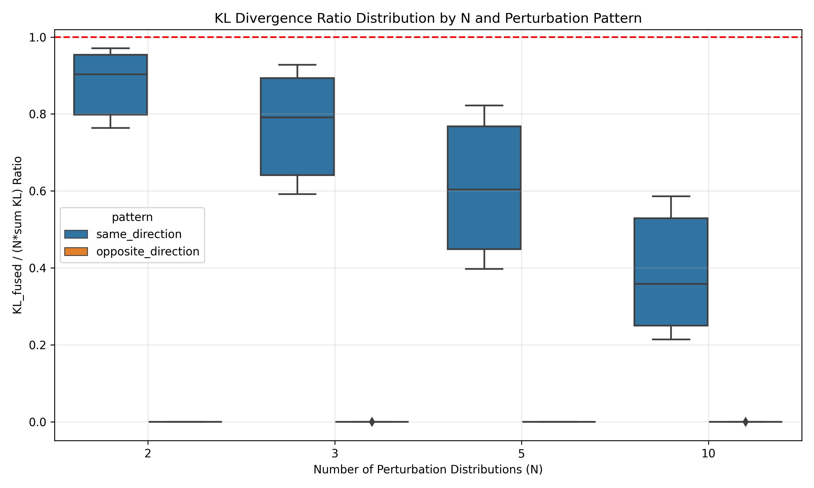

# 尺度参数扰动

本文档展示了尺度参数扰动下的KL散度比较和不等式成立情况的可视化结果。

## 1. 同向扰动

当所有扰动分布的尺度参数向同一方向调整时，KL散度的变化如下图所示：

从图中可以观察到：
- KL散度随尺度参数扰动的绝对值增加而增加
- 融合分布的KL散度（实线）始终小于不等式右侧的值（虚线）
- 正向和负向的尺度参数扰动对KL散度的影响不对称

## 2. 反向扰动

当扰动分布的尺度参数向相反方向调整时，KL散度的变化如下图所示：

从图中可以观察到：
- 融合分布的KL散度显著小于不等式右侧的值
- 尺度参数的反向扰动可能导致参数相互抵消，使融合分布的KL散度接近于零

## 3. 不等式成立比例

下图展示了不同N值和扰动模式下不等式成立的比例：

从图中可以看出，在所有测试的N值和扰动模式下，不等式都成立（比例为1.00）。

## 4. KL散度比率分析

下图展示了不同N值和扰动模式下KL散度比率的分布：

从图中可以观察到：
- 所有比率都小于1，表明不等式在所有测试情况下都成立
- 随着N的增加，比率整体呈下降趋势
- 反向扰动下的比率通常小于同向扰动

这些结果表明，在尺度参数扰动的情况下，KL散度不等式 $D_{KL}(P_0 \| P_{fused}) \le N \sum_{k=1}^N D_{KL}(P_0 \| P_k)$ 在所有测试的参数配置下都成立。
