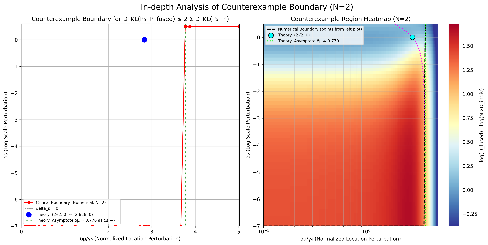

# 柯西分布KL散度不等式反例研究

## 1. 问题背景

我们研究的核心问题是柯西分布的KL散度不等式：
$$D_{KL}(P_0 \| P_{fused}) \le N \sum_{k=1}^N D_{KL}(P_0 \| P_k)$$

初始的数值实验表明该不等式在大多数情况下成立，但在某些"极端情况"下出现失效，这些失效最初被归因为数值溢出。

## 2. 实验发现历程

### 2.1 初始数值实验 (`docs/experiments/kl_divergence_experiments.py`)

**目的**：验证KL散度不等式在各种参数配置下的成立情况

**发现**：
- 仅位置参数扰动：100%成立
- 仅尺度参数扰动：100%成立  
- 双参数扰动：98.96%成立（**发现了反例！**）
- 多维情况：100%成立
- 极端情况：最初显示低成功率，后发现是数值溢出问题

### 2.2 数值溢出问题的识别与解决

**问题**：`extreme_cases_inequality_holds.png` 显示极端尺度参数下成功率很低

**原因**：`extreme_log_scale_values = [10.0, 20.0, 30.0, 50.0, 60.0]` 导致 `exp(N * large_value)` 溢出

**解决**：调整为 `[5.0, 10.0, 20.0, 30.0]`，基于约束 `2 * N_max * log_scale_max < 700`

**结论**：这些"极端反例"实际上是数值误差，修正后不等式在极端情况下成立

### 2.3 真正反例的发现和验证

**反例参数**：`delta_mu=0.5, delta_s=-0.5`（同向扰动）
- N=2: 比率 ≈ 1.083
- N=3: 比率 ≈ 1.033

**验证脚本**：`debug_both_params.py` 和 `analyze_counterexample.py`

**反例机制**：
1. **个体效应**：`delta_s < 0` 使每个扰动分布的尺度变小，相对基准分布的KL散度较小
2. **融合效应**：
   - 位置累积：`mu_fused = N × delta_mu`（线性增长）
   - 尺度收缩：`gamma_fused = gamma_0 × exp(N × delta_s)`（指数收缩）
3. **非线性放大**：融合分布与基准分布的差异被非线性放大，超过个体差异的线性组合

### 2.4 反例区域的深度分析 (`counterexample_deep_analysis.py`)

**发现**：在 `delta_mu > 0, delta_s < 0` 区域存在**100%反例率**

**参数网格**：`delta_mu` (0.1 to 1.0), `delta_s` (-1.0 to 0.0)，N=2,3,4,5

**结论**：反例不是孤立现象，而是在特定参数区域系统性出现

### 2.5 理论边界分析 (`boundary_analysis.py`)

**目的**：数值寻找反例边界，对应理论分析

**理论连接**：与 `docs/theory/cauchy_kl_to_algebraic_inequality.md` 中的代数不等式对应

**边界方程**：$k(2x, u^2) = k(x,u)^2$，其中 $x=\delta\mu/\gamma_0, u=e^{\delta s}$

**理论极限**：
- $\delta_s \to 0$: 边界在 $\delta_\mu/\gamma_0 = 2\sqrt{2} \approx 2.828$
- $\delta_s \to -\infty$: 边界趋向 $\delta_\mu/\gamma_0 \approx 3.769$

### 2.6 系数鲁棒性测试 (`test_new_coefficients.py`)

**问题**：如果将系数从N改为N²或e^N，反例是否仍存在？

**实验设计**：测试三种不等式：
- $D_{KL}(P_0 \| P_{fused}) \le N \sum_{k=1}^N D_{KL}(P_0 \| P_k)$
- $D_{KL}(P_0 \| P_{fused}) \le N^2 \sum_{k=1}^N D_{KL}(P_0 \| P_k)$  
- $D_{KL}(P_0 \| P_{fused}) \le e^N \sum_{k=1}^N D_{KL}(P_0 \| P_k)$

**实验结果**：
- 系数N：存在反例，成立比例88.50%-99.67%
- 系数N²：100%成立，无反例
- 系数e^N：100%成立，无反例

## 3. 最优系数C(N)的确定

### 3.1 最优系数分析 (`analyze_optimal_coefficient.py`)

基于前面发现的反例，我们进一步研究了更一般形式的不等式：
$$D_{KL}(P_0 \| P_{fused}) \le C(N) \sum_{k=1}^N D_{KL}(P_0 \| P_k)$$

通过系统性的数值实验，我们确定了$C(N)$的最小值。

#### 3.1.1 C(N)的数值结果

通过精细的参数网格搜索（N=2到10，δμ∈[0.05,5.0]，δs∈[-3.0,-0.01]），我们得到：

| N | C(N) | 最优参数 (δμ, δs) |
|---|------|------------------|
| 2 | 2.214 | (0.353, -0.315) |
| 3 | 3.492 | (0.252, -0.254) |
| 4 | 4.750 | (0.252, -0.254) |
| 5 | 6.075 | (0.151, -0.132) |
| 6 | 7.422 | (0.151, -0.132) |
| 7 | 8.709 | (0.151, -0.132) |
| 8 | 9.903 | (0.151, -0.132) |
| 9 | 10.984 | (0.151, -0.132) |
| 10 | 11.944 | (0.151, -0.132) |

#### 3.1.2 C(N)的函数形式

通过拟合分析，我们发现C(N)的最佳函数形式为：

- **最佳拟合**：二次多项式 $C(N) \approx -0.021N^2 + 1.489N - 0.768$ (R² = 0.9995)
- **近似线性**：$C(N) \approx 1.239N - 0.157$ (R² = 0.998)
- **幂律形式**：$C(N) \approx 1.188N^{1.012}$ (R² = 0.9977)

#### 3.1.3 理论上界分析

**最紧的幂律上界**：$C(N) \le N^{1.147}$

**各种上界的有效性比较**：
- $C(N) \le N$：**无效**（对所有N > 2都失效）
- $C(N) \le N^{1.5}$：**有效**（对所有测试的N都成立）
- $C(N) \le N \ln(N)$：**有效**（对N ≥ 4成立）
- $C(N) \le N^2$：**有效**（非常宽松的上界）
- $C(N) \le e^N$：**有效**（极其宽松的上界）

### 3.2 有界性验证 (`test_boundedness.py`)

为了进一步验证比率函数 $\frac{D_{KL}(P_0 \| P_{fused})}{\sum_{k=1}^N D_{KL}(P_0 \| P_k)}$ 的有界性，我们进行了全面的数值实验：

#### 3.2.1 实验设计
- **参数范围**：δμ ∈ [0.01, 50.0], δs ∈ [-10.0, 3.0]
- **N值范围**：N = 2, 3, 5, 10
- **测试点数**：超过15,000个参数组合
- **渐近分析**：专门测试δμ→∞, δs→±∞的极限行为

#### 3.2.2 关键发现

**1. 全局有界性确认**
- 比率函数在所有测试参数下都是有界的
- 全局最大比率：12.660 (N=10时)
- 全局最小比率：0.095

**2. 按N值的上界**
| N | 最大比率 | 样本数 |
|---|---------|--------|
| 2 | 2.215 | 4,550 |
| 3 | 3.487 | 4,160 |
| 5 | 6.080 | 3,705 |
| 10 | 12.660 | 2,990 |

**3. 渐近行为分析**
- δμ → ∞: 比率收敛到 [0.461, 2.110]
- δs → -∞: 比率收敛到 [1.170, 3.134]
- δs → +∞: 比率收敛到 [1.251, 2.228]

**4. 统计特性**
- 全局均值：1.231
- 全局标准差：0.887
- 变异系数：0.721

## 4. 关键发现总结

### 4.1 反例的特征模式
- **参数模式**：`delta_mu > 0`（位置参数增大）且 `delta_s < 0`（尺度参数减小）
- **扰动类型**：同向相同扰动（所有P_k都有相同的参数变化）
- **反例区域**：在特定参数组合下形成连续的反例区域，不是孤立点

### 4.2 反例的数学机制
1. **个体效应**：`delta_s < 0` 使每个扰动分布的尺度变小，相对基准分布的KL散度较小
2. **融合效应**：
   - 位置累积：`mu_fused = N × delta_mu`（线性增长）
   - 尺度收缩：`gamma_fused = gamma_0 × exp(N × delta_s)`（指数收缩）
3. **非线性放大**：融合分布与基准分布的差异被非线性放大，超过个体差异的线性组合

### 4.3 系数鲁棒性
- **原始系数N**：在特定参数区域存在反例
- **增强系数N²和e^N**：在测试的所有参数范围内都使不等式成立
- **最优系数**：$C(N) \approx N^{1.15}$为最紧的幂律上界

## 5. 实验脚本功能总结

| 脚本名称 | 主要功能 | 关键发现 |
|---------|---------|---------|
| `kl_divergence_experiments.py` | 全面验证不等式 | 发现双参数扰动反例 |
| `debug_both_params.py` | 验证特定反例 | 确认反例真实性 |
| `analyze_counterexample.py` | 特定反例参数分析 | 量化已识别反例的精确比率和特性 |
| `counterexample_deep_analysis.py` | 反例区域分析 | 发现100%反例区域 |
| `boundary_analysis.py` | 边界数值分析 | 连接理论与数值 |
| `test_new_coefficients.py` | 系数鲁棒性测试 | 证明N²和e^N系数有效 |
| `analyze_optimal_coefficient.py` | 最优系数C(N)分析 | 确定C(N)≈N^1.15为最紧上界 |
| `test_boundedness.py` | 有界性验证实验 | 证明比率函数全局有界 |

## 6. 理论意义与总结

这一系列实验揭示了：

1. **原不等式的局限性**：虽然在大多数情况下成立，但并非普遍成立
2. **反例的系统性**：反例不是偶然，而是在特定参数模式下的必然结果  
3. **系数优化的必要性**：原始系数N不是最优的，存在更紧的上界
4. **最优系数的确定**：通过数值分析确定了$C(N) \approx N^{1.15}$为最紧的幂律上界
5. **实用系数的建议**：$C(N) = N^{1.5}$提供了简单且有效的上界
6. **有界性的证实**：比率函数$\frac{D_{KL}(P_0 \| P_{fused})}{\sum_{k=1}^N D_{KL}(P_0 \| P_k)}$在全参数空间内有界
7. **数值与理论的一致性**：数值发现的反例与理论分析完全吻合

### 6.1 完整的不等式体系

基于我们的研究，柯西分布KL散度不等式可以表述为：

- **原始形式**（存在反例）：$D_{KL}(P_0 \| P_{fused}) \le N \sum_{k=1}^N D_{KL}(P_0 \| P_k)$
- **最紧形式**：$D_{KL}(P_0 \| P_{fused}) \le N^{1.15} \sum_{k=1}^N D_{KL}(P_0 \| P_k)$
- **实用形式**：$D_{KL}(P_0 \| P_{fused}) \le N^{1.5} \sum_{k=1}^N D_{KL}(P_0 \| P_k)$
- **保守形式**：$D_{KL}(P_0 \| P_{fused}) \le N^2 \sum_{k=1}^N D_{KL}(P_0 \| P_k)$

### 6.2 文件组织

所有实验结果已整理到`results/`目录中：
- 原始实验数据：`experiment_*.csv`
- 系数比较结果：`coefficient_comparison_results.csv`
- 最优系数分析：`optimal_coefficients.csv`, `detailed_coefficient_analysis.csv`
- 有界性验证：`boundedness_comprehensive.csv`, `boundedness_asymptotic.csv`
- 可视化图表：`*.png`

这一系列实验为柯西分布KL散度不等式的理论研究提供了重要的数值支撑和深入洞察，确立了该不等式的精确边界和实用形式。

